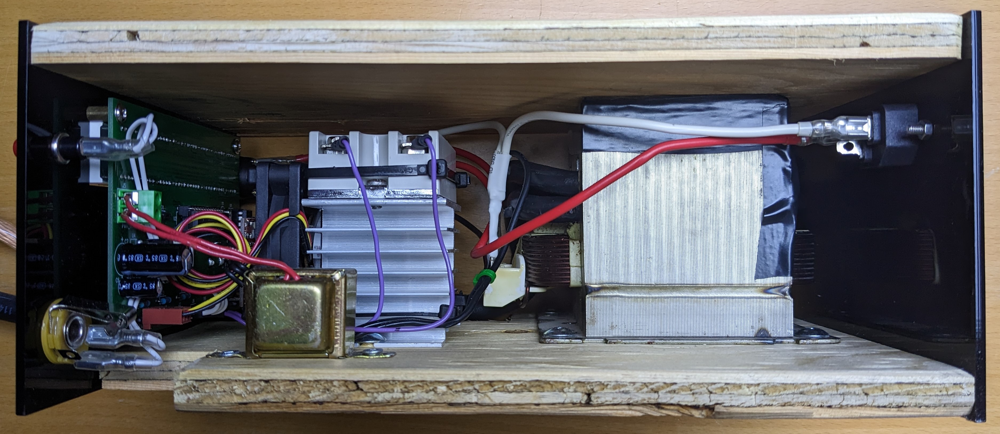
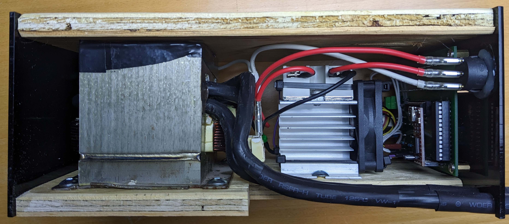
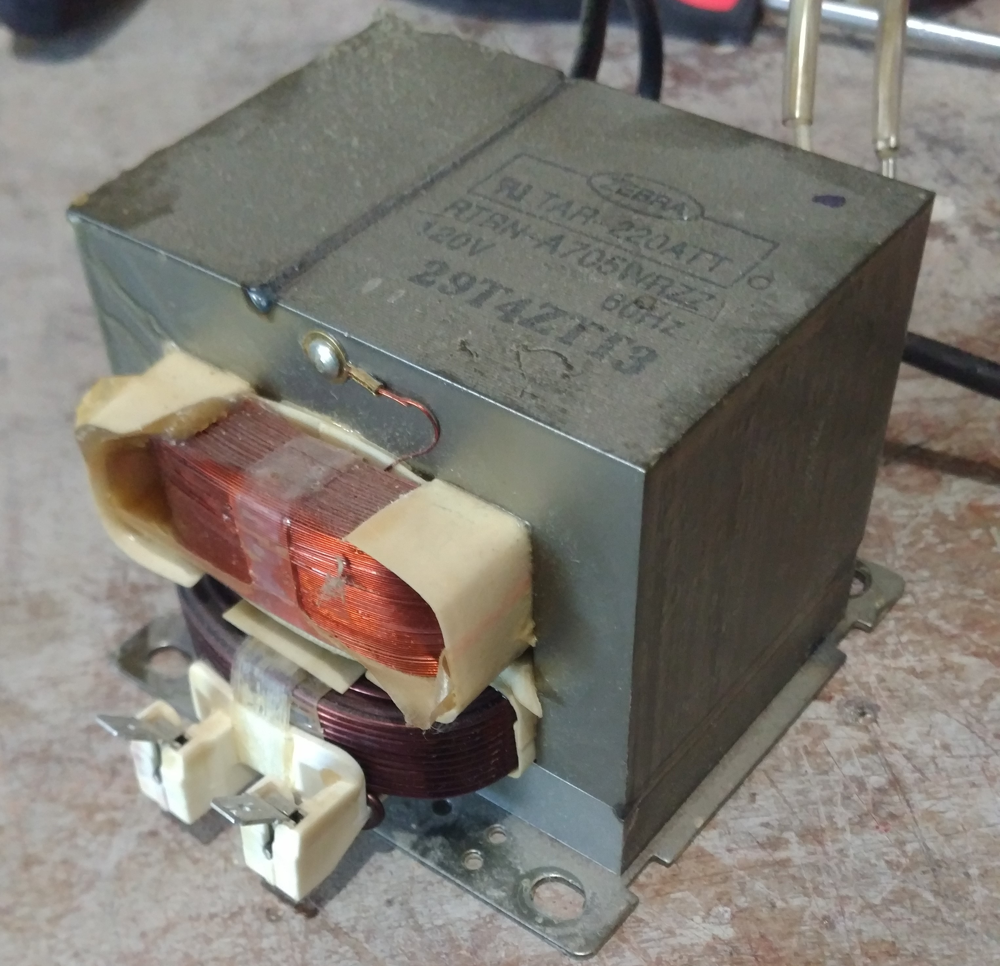

# Spot Welder

## Features

1. Precise microsecond timing resolution selected via an encoder wheel.
2. Three user-programmable timing presets which are accessible via the buttons.
3. A 1/4 inch jack for an external footpedal. See the `mechanical` folder for a simple 3D printable footpedal design.

## Internals

## Principles of Operation

The spot welder is build around a recycled microwave transformer which has had its secondary coil rewound to produce a high current and low voltage (2 turns of 4AWG). The microwave and unmodified transformer are shown below.

 A solid state relay (SSR) is used to create precise pulses to produce welds by controlling the primary side. Because of the large currents that it will need to handle it is heatsunk and actively cooled with a small computer fan.

