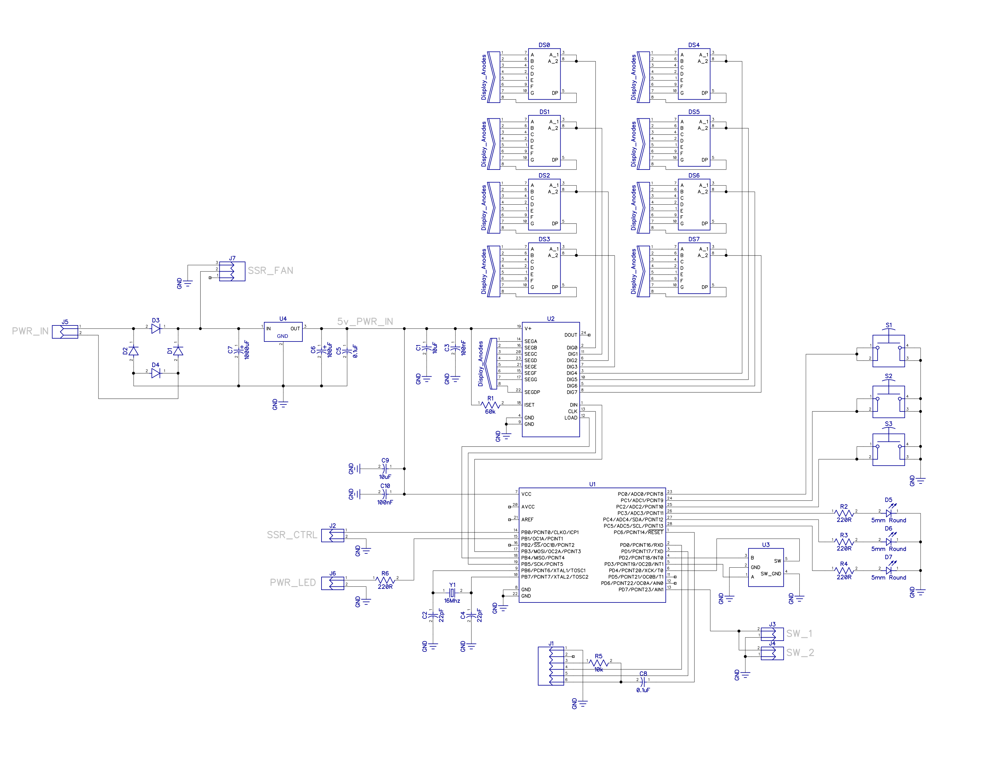

# Electrical

## Design Software

Designed with [DipTrace](https://diptrace.com/). Sourcefiles for both the schematic (`schematic.dch`) and pcb (`pcb.dip`) are provided.

## Schematic

## PCB

Most of the 3D models used for these renders are included in DipTrace's 3D model [download](https://diptrace.com/download/libraries-and-3d-models/). The models for the encoder and one of the terminal blocks are included in the `3rd_party` directory.

The generated mechanical model is also provided as `pcb.step`.
