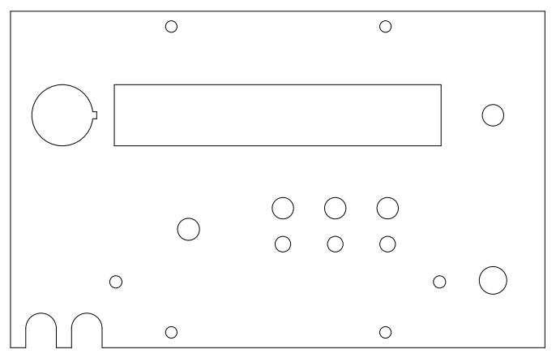
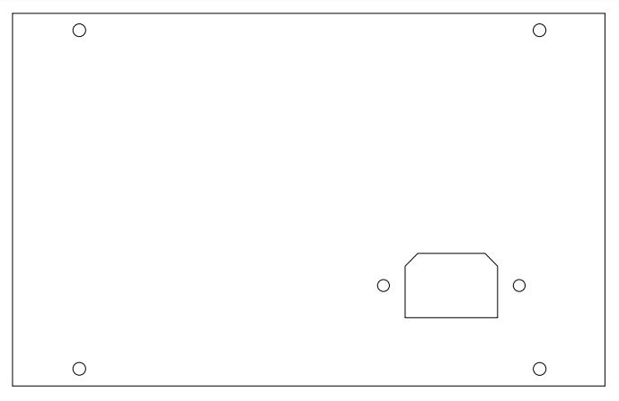
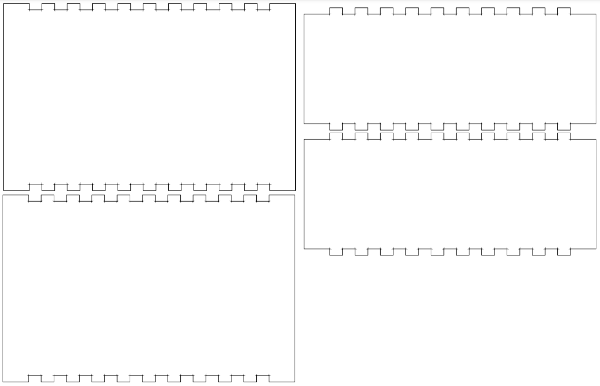

## Enclosure

The [front plate](./enclosure/front_plate.pdf) and [back plate](./enclosure/back_plate.pdf) are each around `185x130mm` and should be cut out of `3mm` acrylic.

The [shell](./enclosure/shell.pdf) requires an entire `18x24inch` sheet of 6mm acrylic.

